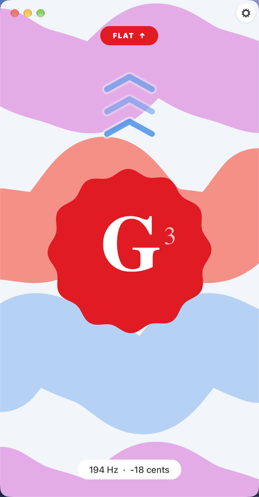
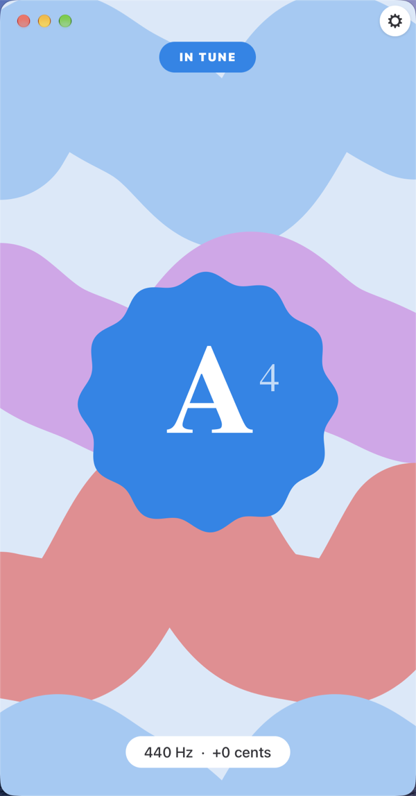
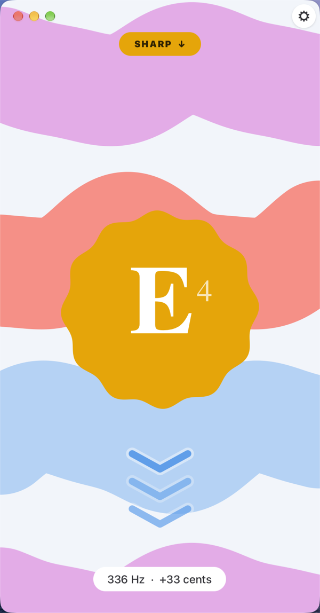
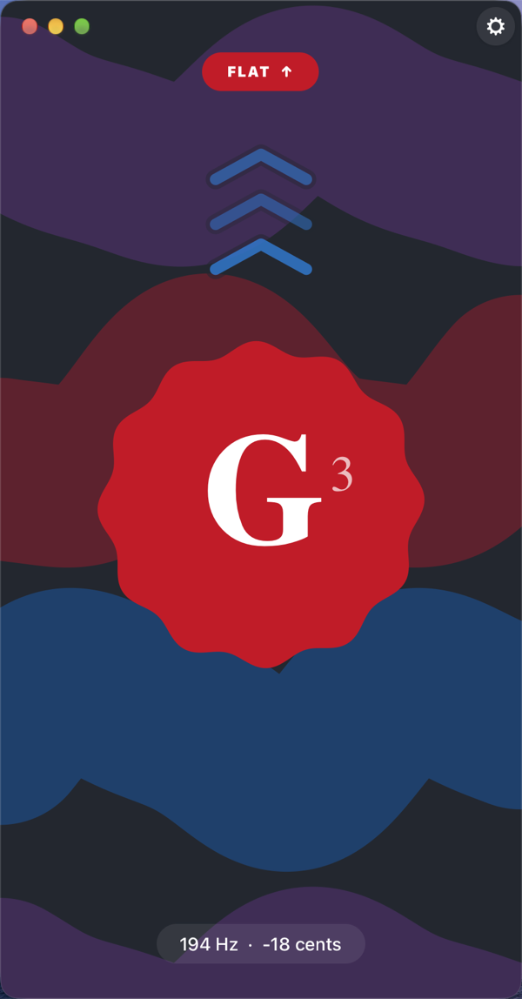
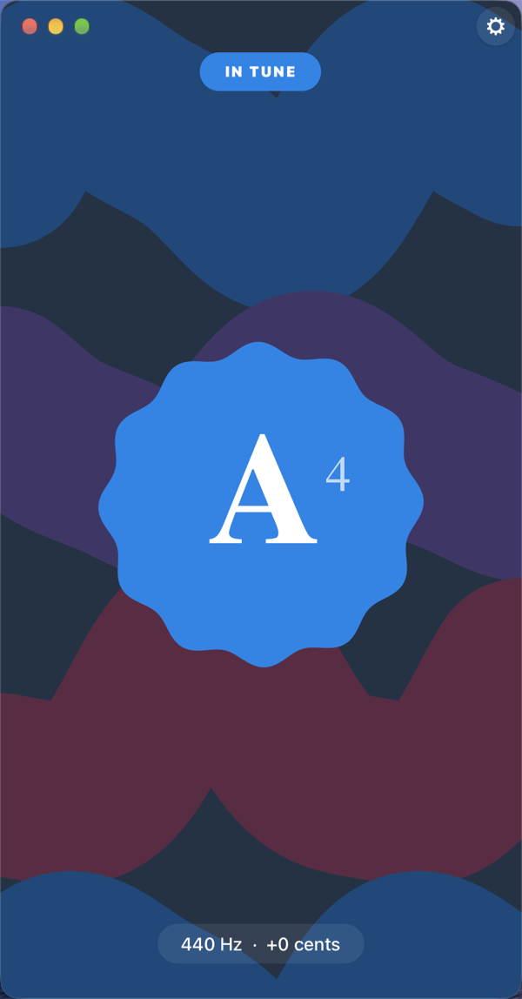
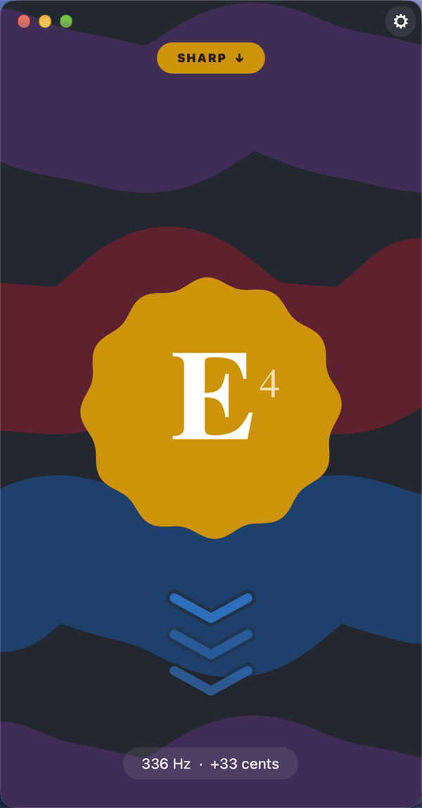
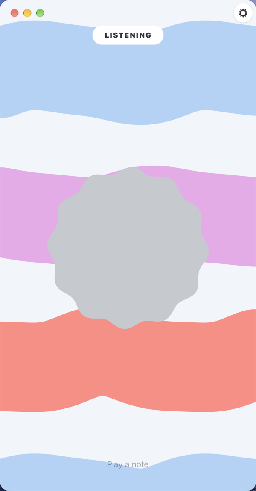
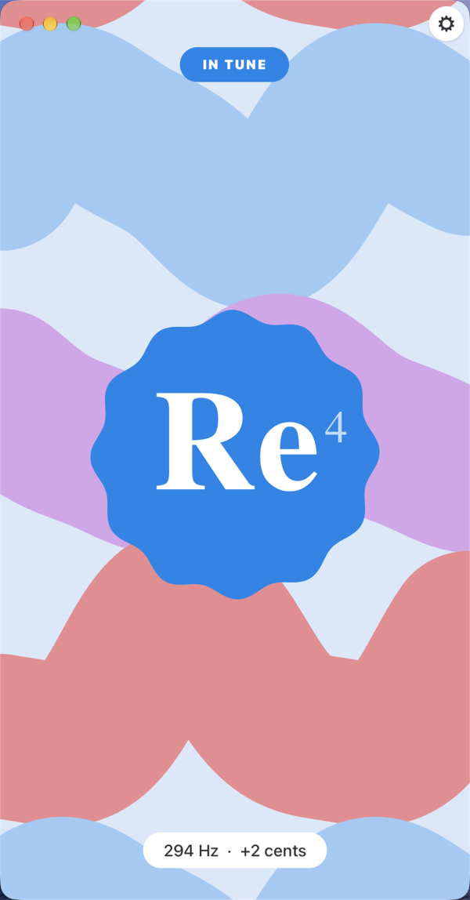
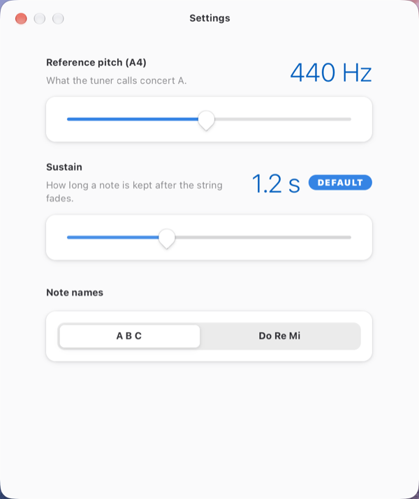
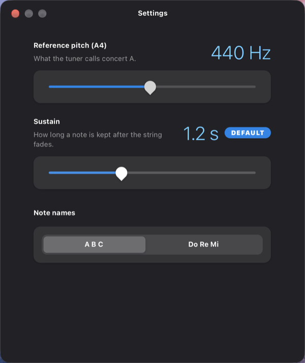

# Vibes 🎸

**A chromatic instrument tuner for GNOME. Play a note — it tells you which one, and which way to turn the peg.**

Vibes is a free, open-source chromatic tuner for Linux desktops and phones, written in Rust with
GTK 4, libadwaita and [relm4](https://relm4.org). It hears any note through the microphone, names
it, and shows how far off you are in cents. No instrument presets, no account, no network — the
audio never leaves the machine.

<p align="center">
  
  
  
</p>
<p align="center">
  
  
  
</p>

---

## Why another tuner

Most desktop tuners look like test equipment: a needle, a strobe, a grid of numbers. You have to
read them. Vibes is built so you can tune while looking at the instrument instead of the screen —
the whole window changes colour and direction, and you catch it in your peripheral vision.

- **One glance tells you everything.** The note sits in a big serif inside a coloured sticker.
  Red means flat, amber means sharp, your accent colour means in tune.
- **The background shows the direction.** A full-bleed field of wavy bands drifts **up when you
  are flat, down when you are sharp** — faster the further off you are, and still once you lock in.
- **The sticker rings at the note it hears.** Its twelve lobes pump at the detected frequency
  itself, dropped by whole octaves into a range the eye can follow: A4 becomes 3.4 Hz, the low E
  of a guitar 2.6 Hz. Once you are in tune it falls still and only breathes.
- **It keeps chasing a decaying string.** Pluck once and the reading holds for 1.2 s after the
  note falls below the noise floor, so you can turn the peg with both hands.

## Features

| | |
|---|---|
| **Chromatic** | Hears any note, all twelve pitch classes across every octave. Nothing to select. |
| **Exact readout** | Frequency in Hz and deviation in cents. In tune means within ±5 cents. |
| **Reference pitch** | A4 adjustable from 415 Hz (baroque) to 466 Hz, in 1 Hz steps. |
| **Note names** | `A B C` or `Do Re Mi` — solfège for anyone who learned it that way. |
| **Sustain** | How long a note is held after the string fades: 0.5–2.5 s, default 1.2 s. |
| **Follows your theme** | Takes the accent colour and light/dark from the system, live, without a restart. |
| **Adaptive** | The same layout from a 360 × 294 phone window to a maximised desktop one. |
| **Offline** | Opens no sockets. The microphone stream is analysed in memory and discarded. |
| **Small** | An 868 KB binary, and no runtime dependencies beyond GTK 4 and libadwaita. |

<p align="center">
  
  
  
  
</p>

## Install

Vibes needs GTK 4, libadwaita 1.7 or newer, and a Rust toolchain. On Linux it also builds
against PipeWire and ALSA (`libpipewire-0.3` headers and libclang).

```bash
git clone https://github.com/NicoNex/vibes-gtk
cd vibes-gtk
make            # builds release, leaves ./vibes in the repository root
make install    # binary, desktop entry and icons under ~/.local
```

`make install` honours `PREFIX` and `DESTDIR`, so packagers can point it anywhere:

```bash
make install PREFIX=/usr DESTDIR="$pkgdir"
```

To try it without installing:

```bash
make run
```

### Building for ARM Linux

For a Raspberry Pi, a PinePhone, a Librem 5 or an ARM server, build on the device itself with
`make` — or, from another machine, inside an arm64 container:

```bash
make linux-arm64      # needs docker or podman; leaves ./vibes-linux-arm64
```

GTK cannot be cross-linked from a foreign host without a full target sysroot, since `gtk4-sys`
asks pkg-config for the target's GTK, libadwaita and ALSA. Building inside the target's own
container sidesteps that. On Apple Silicon the arm64 container runs natively rather than
emulated; on an x86_64 Linux host it runs under QEMU, which needs `qemu-user-static` registered
with binfmt_misc (on Arch: `qemu-user-static qemu-user-static-binfmt`). Point it at another architecture with `CROSS_PLATFORM`:

```bash
make linux-arm64 CROSS_PLATFORM=linux/amd64 CROSS_OUT=vibes-linux-amd64
```

## How it works

Vibes detects pitch with a **YIN autocorrelation detector** (de Cheveigné & Kawahara, 2002),
running on a worker thread so the audio callback never blocks.

Each detection window is 4096 samples — about 93 ms at 44.1 kHz, long enough to resolve the low E
of a bass guitar. Every window goes through:

1. **DC removal**, so a microphone's bias offset does not swamp a quiet signal.
2. **A silence gate, set low on purpose.** YIN's own clarity threshold rejects broadband noise
   whatever its level, so the gate only has to skip true silence — which is what keeps quiet
   notes usable.
3. **The difference function and its cumulative mean normalisation**, then the first minimum
   below a clarity threshold of 0.15.
4. **Parabolic interpolation** around that minimum, for sub-sample accuracy.
5. **A median of the last five readings**, which rejects single-frame outliers.
6. **Octave-error correction.** A reading near double or half the running estimate is folded back
   toward it — this is where naive detectors report a guitar's low E an octave high.
7. **A grace hold**, so a plucked note is still chased as it decays below the gate.

The interface is drawn in Cairo against the frame clock, over shared animation state the relm4
update loop never touches. Every animated value chases its target on an exponential curve rather
than a fixed-duration tween, so changing the target mid-flight never snaps or restarts.

## Frequently asked questions

**Does Vibes work with any instrument?**
Yes. It is chromatic — it reports whatever note it hears, so it works for guitar, bass, violin,
ukulele, brass, voice, or a piano you are checking string by string. There are no instrument
presets to choose between.

**Does it need an internet connection?**
No. Vibes opens no network sockets at all. Audio is read from the microphone, analysed in memory
and discarded; the only thing written to disk is your three settings.

**How accurate is it?**
The readout is in cents — hundredths of a semitone. "In tune" means within ±5 cents, roughly the
point where a trained ear stops hearing beating against a reference.

**Does it run on a Linux phone?**
Yes. The window goes down to 360 × 294, GNOME Mobile's floor, and the sticker, the chevrons and
the note's typography all size themselves from the space they are given rather than from fixed
pixel values.

**Why is A4 adjustable down to 415 Hz?**
415 Hz is the common baroque pitch standard, about a semitone below modern concert pitch.
Ensembles playing period instruments tune there.

**Does it work on Wayland and X11?**
Both. It is an ordinary GTK 4 application and makes no display-server-specific calls.

**Which audio system does it use on Linux?**
PipeWire, natively. Where PipeWire is not running it falls back to ALSA's default device.

**How do I change the colours?**
You don't, directly. Vibes derives its whole palette from your system accent colour and your
light/dark preference, using libadwaita's own palette for the wave bands. Change the accent in
GNOME Settings and the app follows straight away.

## Relationship to the Android app

Vibes began as an Android app in Kotlin and Jetpack Compose.
This is a port, not a wrapper: the interface was rebuilt on Adwaita's own colours and widgets
instead of reproducing Material 3 Expressive.

| Android | Here |
|---|---|
| Material You wallpaper palette | The libadwaita accent colour and the Adwaita palette, followed live |
| `MaterialShapes.Cookie12Sided` | The same silhouette, drawn in Cairo from a single polar radius |
| `MotionScheme` spring specs | Frame-rate independent exponential chase on every animated value |
| Compose predictive back | An `AdwPreferencesDialog`, behind the primary menu |
| Runtime microphone permission | The desktop has none; a failure shows an `AdwStatusPage` |
| Haptics on lock and slider steps | Dropped — desktops have no vibrator |

The pitch DSP is a line-for-line port, and its tests came across with it.

## Development

```bash
make test       # the pitch DSP, the note maths and settings parsing
make check      # the above, plus cargo fmt --check
make preview    # renders the painted layer to PNGs in /tmp, no window needed
make icons      # regenerates the app icon and its symbolic variant
```

`VIBES_DEMO_HZ` pins the reading to a fixed frequency and leaves the microphone closed — which is
how the screenshots above were taken, without an instrument. `VIBES_DEMO_HZ=0` gives the idle
screen.

| File | |
|---|---|
| `src/pitch.rs` | YIN detector and note maths. No GTK, fully tested. |
| `src/audio.rs` | cpal capture, the detection worker, and the smoothing that follows it |
| `src/paint.rs` | The palette, the animation state, and every Cairo drawing routine |
| `src/main.rs` | The tuner window |
| `src/settings.rs` | The preferences dialog |
| `data/icons/` | The app icon on the GNOME HIG canvas, and the script that generates it |

## Status

Working. Built and run against GTK 4.24 and libadwaita 1.10. On Arch Linux, `make arch` builds a
pacman package in the repository root (`sudo pacman -U vibes-*.pkg.tar.zst`); elsewhere
`make install` is the supported route. For a phone on postmarketOS, `make postmarketos` builds an
aarch64 `.apk` inside an Alpine container (`apk add --allow-untrusted vibes-*.apk` on the phone).
There is no Flatpak yet.

## License

GPL-3.0-or-later. See [`LICENSE`](LICENSE).
